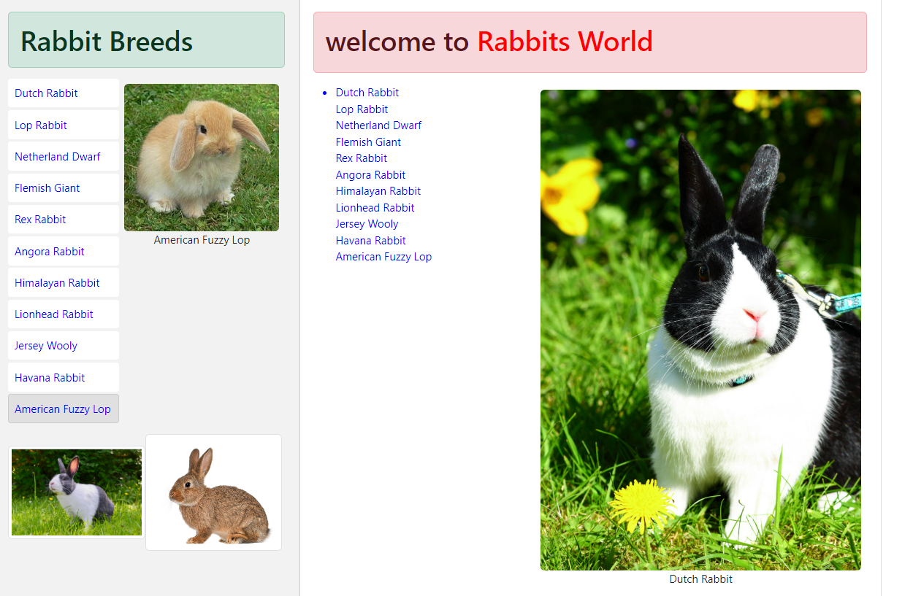

# Rabbits world



This application utilizes various technologies, including Vite for fast development, React for building user interfaces, and Bootstrap for styling and layout.

# main.tsx

```javascript
import React from "react";
import ReactDOM from "react-dom";
import App from "./App.tsx";
import App2 from "./App2.tsx";
import "bootstrap/dist/css/bootstrap.css";

const rootElement = document.getElementById("root");
const linksElement = document.getElementById("links");

ReactDOM.createRoot(rootElement).render(
  <React.StrictMode>
    <App />
  </React.StrictMode>
);

ReactDOM.createRoot(linksElement).render(
  <React.StrictMode>
    <App2 />
  </React.StrictMode>
);
```

The provided code snippet is a React application entry point that renders the main component of the application using React's `createRoot` and `ReactDOM.render` methods. It also applies the Bootstrap CSS framework for styling. Let's break down the code step by step:

1. **Imports:**

   - `React` is imported from the 'react' library, which is the core of the React framework.
   - `ReactDOM` is imported from 'react-dom/client', which provides methods for rendering React components to the DOM.
   - The `App` component is imported from './App.tsx', presumably the main component of the application.
   - The 'bootstrap/dist/css/bootstrap.css' file is imported to apply Bootstrap's styling to the application.

2. **Rendering:**

   - `ReactDOM.createRoot(document.getElementById('root')!)` creates a root element where the React component hierarchy will be mounted. It uses `document.getElementById('root')` to find the DOM element with the ID 'root' where the application will be rendered.

3. **Rendering the Main Component:**
   - The `createRoot` instance's `render` method is used to render the main `App` component.
   - The `App` component is wrapped in a `React.StrictMode` component. `<React.StrictMode>` is a development mode feature that checks for potential problems in the application and provides helpful warnings.

In summary, this code sets up a React application by importing the necessary libraries, rendering the main `App` component inside a `React.StrictMode`, and using `createRoot` to attach the application to the HTML element with the ID 'root'. The application's visual styling is enhanced using Bootstrap's CSS framework. It's important to note that the code assumes there is an HTML file with an element having the ID 'root' where the React application will be mounted.

## ListGroup.tsx

The provided code defines a React component called `ListGroup`. This component takes in two props: `items` and `heading`. It renders a list of items with the ability to highlight and select a specific item. Here's a breakdown of the code:

```javascript
import React, { useState } from "react";

interface Props {
  rabbitBreeds: { [key: string]: string };
  heading: string;
}

function ListGroup({ rabbitBreeds, heading }: Props) {
  const [selectedBreed, setSelectedBreed] = (useState < string) | (null > null);

  const handleBreedClick = (breed: string) => {
    setSelectedBreed(breed);
  };

  return (
    <>
      <h1>{heading}</h1>
      <div style={{ display: "flex" }}>
        <div style={{ flex: 2 }}>
          <ul style={{ listStyle: "none", padding: 0 }}>
            {Object.keys(rabbitBreeds).map((breed) => (
              <li
                key={breed}
                className={
                  selectedBreed === breed ? "btn-success" : "list-group-item"
                }
                onClick={() => handleBreedClick(breed)}
                style={{
                  color: "blue",
                  cursor: "pointer",
                  padding: "8px",
                  backgroundColor:
                    selectedBreed === breed ? "#e0e0e0" : "white",
                  border:
                    selectedBreed === breed
                      ? "1px solid #ccc"
                      : "1px solid transparent",
                  borderRadius: "4px",
                  marginBottom: "4px",
                }}
              >
                {breed}
              </li>
            ))}
          </ul>
        </div>
        <div style={{ flex: 3 }}>
          {selectedBreed && (
            <div className="mx-auto p-2">
              
              <p className="text-center mt-2">{selectedBreed}</p>
            </div>
          )}
        </div>
      </div>
    </>
  );
}

export default ListGroup;
```

Here's what the component does:

1. The `useState` hook is imported from the `react` library to manage a state variable called `selectedItem`. This state will keep track of the index of the currently selected item in the list.

2. Inside the `ListGroup` component's return statement, it renders an `<h1>` element displaying the provided `heading`.

3. It renders an unordered list (`<ul>`) with a class of `"list-group"` to style the list items.

4. Within the `<ul>`, it maps through the `items` prop array using the `map` function. For each item, it renders a list item (`<li>`) element.

5. The `className` of each list item is conditionally set based on whether the index matches the `selectedItem` state. If it matches, the `"list-group-item active"` class is applied, indicating the currently selected item. Otherwise, it only gets the `"list-group-item"` class.

6. An `onClick` event handler is attached to each list item. When clicked, it logs the new value of `selectedItem` to the console using the `setSelectedItem` function. However, note that this function call should be used to update the state, not just to log the value.

In summary, the `ListGroup` component is designed to display a list of items, highlight the selected item, and log the selected item's index when clicked.

# App.tsx

```javascript
import ListGroup from "./components/ListGroup.tsx";
import Rabbit from "./components/button.tsx";

function App() {
  const rabbitBreeds = {
    "Dutch Rabbit": "link",
    "Lop Rabbit": "link",
    // add more type
    // const rabbitBreeds = [

    //   "Netherland Dwarf",
    //   "Flemish Giant",
    //   "Rex Rabbit",
    //   "Angora Rabbit",
    //   "Himalayan Rabbit",
    //   "Lionhead Rabbit",
    //   "Jersey Wooly",
    //   "Havana Rabbit",
    //   "American Fuzzy Lop",
    //   "New Zealand Rabbit",
    // ];
  };

  const headingRabbitBreeds = "Rabbit Breeds";

  return (
    <div>
      <ListGroup rabbitBreeds={rabbitBreeds} heading={headingRabbitBreeds} />
      <Rabbit />
    </div>
  );
}

export default App;
```

The provided code snippet seems to be a React web application that displays two lists: a reading list of books and a list of recommended summer travel destinations. The application utilizes the Bootstrap CSS framework for styling and uses a custom component named `ListGroup` to render the lists.

Here's a breakdown of the components and features in the code:

1. **Importing Bootstrap Styles:**
   The Bootstrap CSS styles are imported to apply predefined styling to the components.

2. **Data Arrays:**

   - `books`: An array containing the titles and authors of various books.
   - `summerTravelDestinations`: An array containing the names of recommended summer travel destinations.

3. **Headings:**

   - `headingReadingList`: A string defining the heading for the reading list section.
   - `headingPlaces`: A string defining the heading for the recommended places section.

4. **Custom Component - `ListGroup`:**

   - It's likely that there's a `ListGroup` component defined in a separate file named `ListGroup.tsx`. This component is presumably responsible for rendering a list of items with the specified heading.

5. **Main App Component:**
   The `App` component is the main entry point of the application.

   - It renders two sections wrapped in `div` elements.
   - The first section displays the reading list using the `ListGroup` component, passing the `books` array as items and the `headingReadingList` as the heading.
   - The second section displays the summer travel destinations using the `ListGroup` component, passing the `summerTravelDestinations` array as items and the `headingPlaces` as the heading.

6. **Export:**
   The `App` component is exported as the default export of the module, making it available for use in other parts of the application.

Overall, this code represents a simple React application that presents a user interface with two sections: a reading list of books and a list of recommended summer travel destinations. The styling is influenced by Bootstrap, and the application uses a custom `ListGroup` component to display the lists.
